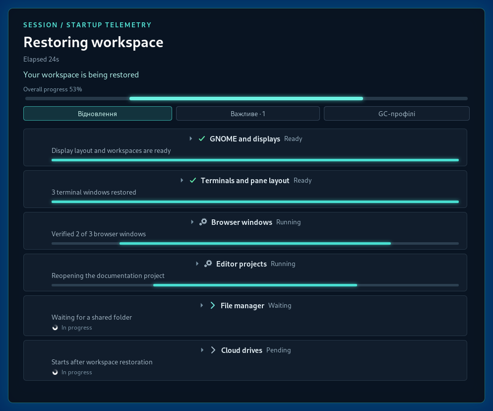
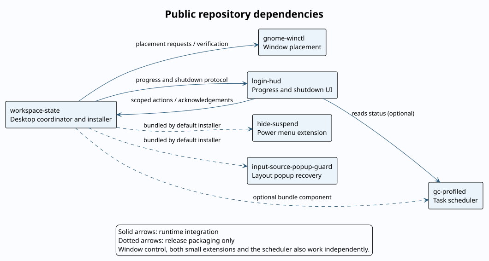

# Workspace State

Save and restore a GNOME Wayland desktop: application windows, workspaces,
monitors, browser tabs and terminal layouts. Requires Python 3.11+ and GNOME 46.



Native HUD screenshot with example data. [More screenshots](docs/visual-guide.md).

- Restore Chrome, Alacritty/tmux, VS Code, Nemo and supported social apps.
- Save a checkpoint before confirmed shutdown; recover prepared jobs on cancel.
- Keep the last good checkpoint when a new capture is incomplete.
- Show restoration progress and reported application problems in Login HUD.

## Install

Clone the companion repositories listed in
[the release manifest](config/desktop-release.toml) beside this checkout.
Review [setup requirements](docs/reference.md#install) before installing;
optional host integrations need local configuration.

```sh
make check
make install
```

Installation is scheduled for the next graphical login. Chrome also needs its
[companion extension in each managed profile](docs/reference.md#install).

## Use

```sh
wsctl save                 # replace the saved desktop state
wsctl show --details       # inspect it
wsctl restore --dry-run    # preview restoration
wsctl restore              # restore saved applications and placement
wsctl deployment doctor   # compare source, installed and running versions
```

A waiting placement is not a completed restore. Check the HUD details before
retrying or replacing a saved checkpoint.

## Repositories



Solid arrows show runtime integration; dotted arrows show packaging only.
[PlantUML source](docs/repository-dependencies.puml) · [Layout and submodule proposal](docs/repositories.md)

## Documentation

- [Usage and screenshots](docs/visual-guide.md)
- [Configuration and commands](docs/reference.md)
- [Deployment and rollback](docs/deployment.md)
- [Report problems to the HUD](docs/owned-system-alerts.md)
- [Architecture](docs/architecture.svg) · [PlantUML](docs/architecture.puml)
- [Shutdown sequence](docs/shutdown-flow.svg) · [PlantUML](docs/shutdown-flow.puml)
- [Tests](tests/integration/README.md) · [Releases](docs/publication.md)
