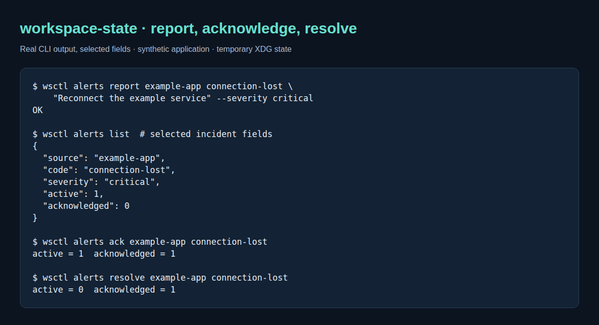
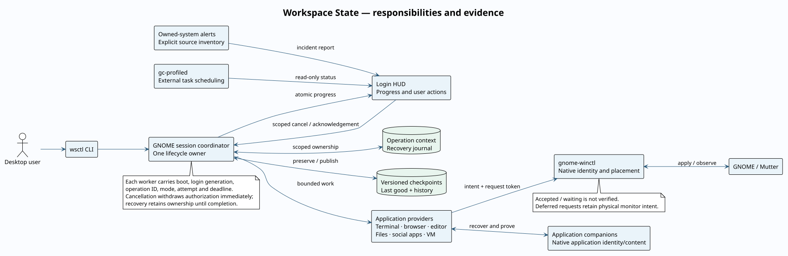
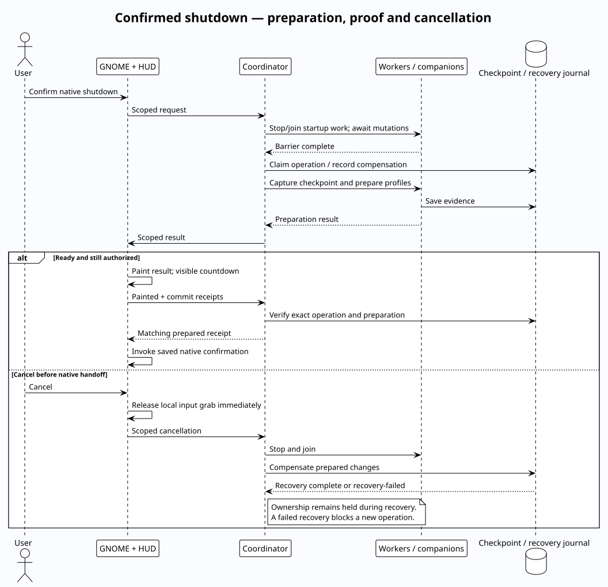

# Workspace State: user guide and visual overview

Workspace State coordinates restoration; it does not implement every application's
recovery itself. Application companions identify native windows and content,
`gnome-winctl` applies and verifies placement, and Login HUD presents the result.

## Start here

| Goal | Guide |
|---|---|
| Install or update the coordinated desktop tools | [Deployment and rollback](deployment.md) |
| Understand component ownership | [General design](#general-design) |
| Restore browser/editor/file windows | [Main README](../README.md), [editor](vscode.md), [file manager](file-manager.md) |
| Add an application's problems to the HUD | [Owned-system alerts](owned-system-alerts.md) |
| Understand a waiting or failed restore | [Provider evidence](provider-contract.md) |
| Investigate cancellation and recovery | [Lifecycle ownership](lifecycle-architecture.md) |
| Build and publish | [Publication](publication.md) |

Python 3.11+ and native GNOME Wayland are required. The Shell integrations target
GNOME 46. A standalone checkout supports `make check`; production desktop
installation uses the sibling components listed in `config/desktop-release.toml`.
Review that manifest and host-specific settings before adopting the complete
bundle on another machine. Some optional host integrations are intentionally
specific to an existing installation.

```sh
make check
./bin/wsctl --help
./bin/wsctl deployment doctor
```

After reviewing the [deployment guide](deployment.md), `make install` stages and
schedules the bundle for the next graphical login. It does not reload the running
Shell. Configure each browser profile's companion separately as described in the
[installation instructions](reference.md#install). Keep personal checkpoints,
profiles and runtime reports outside the checkout.

## What restoration looks like


This is the current Login HUD running in a disposable GNOME compositor with
synthetic application progress, not a capture of a personal desktop. The
coordinator normally supplies these records. A successful row means its producer
reported success; individual provider evidence distinguishes identity, content and
placement. See the [HUD visual guide](https://github.com/Sage-Cat/login-hud/blob/master/docs/screenshots.md)
for the full UI capture procedure and additional views.

| Result | Meaning | Next step |
|---|---|---|
| Running | A bounded operation is still executing | Expand its progress or wait for its deadline |
| Waiting | Content or placement is accepted but unverified | Inspect provider evidence; a deferred placement can await workspace activation |
| Ready | The reported work completed | Check application-specific content guarantees if needed |
| Degraded | The producer retained a safe fallback | Read the row's details before replacing saved state |
| Failed | A required step could not be proved | Repair the named companion or dependency; preserve the last good checkpoint |

Avoid repeatedly launching a restore to clear a waiting row. Placement queries
observe the original request token and do not need a second application launch.

## Report a problem to the HUD



The image renders real CLI results from temporary configuration/state directories.
Only selected incident fields are shown, and the source is a synthetic
`example-app`. Acknowledgement records that the user saw a problem; it does not
resolve it. Resolution follows application-verified recovery. The startup-only
Important tab displays active critical/blocker incidents; a report cannot reopen
the HUD or interfere with shutdown.

1. Register the application as a first-party `events` source in the private
   `workspace-state/alerts.d/` inventory.
2. Run `wsctl alerts report SOURCE CODE MESSAGE --severity critical` when a
   real failure is detected.
3. Run `wsctl alerts resolve SOURCE CODE` after verifying recovery.

Use stable source/code IDs, concise safe messages and event IDs for retried
reports. Do not publish raw logs, tokens or private URLs. The complete schema and
commands are in [owned-system alerts](owned-system-alerts.md).

## General design



[Editable PlantUML source](architecture.puml).

The coordinator owns lifecycle transitions and recovery. Its workers carry one
immutable operation context; callbacks from an old login or operation cannot
publish into a newer one. Providers own application-specific evidence. Checkpoints
store desired state independently of progress and retry markers. Native placement
belongs to the separate window-control service.

GC scheduling and incident collection are independent of restoration. The HUD
reads their reports; viewing those tabs does not run cleanup or repair commands.



[Editable PlantUML source](shutdown-flow.puml).

A native confirmation starts preparation, not immediate shutdown authorization.
The coordinator requires checkpoint evidence and operation-bound HUD receipts
before final handoff. Cancel releases the HUD's input grab locally and withdraws
authorization immediately. Recovery retains the operation owner until rollback
finishes; a failed rollback remains visible and blocks another attempt.

## Troubleshooting

| Symptom | Inspect | Expected boundary |
|---|---|---|
| Updated source but old UI/protocol | `wsctl deployment doctor` | Source, scheduled, installed and running versions differ until activation |
| Browser companion unavailable | Browser extensions page and profile mapping | Every managed profile needs the matching native host and companion |
| Correct content, wrong workspace | Provider placement phase and `gnome-winctl status --json` | Accepted placement is not final verification |
| Important tab is empty | `wsctl alerts sources` and `wsctl alerts list` | Only registered sources and active critical/blocker incidents appear |
| Shutdown cancelled, recovery remains | Operation/recovery details | Ownership stays held until compensation finishes |
| Same-boot login has no HUD | [Startup ownership](startup-ownership.md) | Restoration may run in the background without reopening the first-boot HUD |

Do not delete checkpoint or ownership files to force a clean-looking status.
They distinguish recoverable work from unsafe retries.

## Reproduce the visuals

From this checkout, with Python and a locally installed Chrome/Chromium:

```sh
python3 docs/capture-cli.py
```

This runs report/acknowledge/resolve against a disposable event-only inventory,
renders the captured fields in a headless browser, and deletes the temporary
state. It does not scan services or alter the real inventory. Native HUD capture
is maintained in the Login HUD repository; copy its current startup image to
`docs/screenshots/restoration.png` when changing the shared UI contract.

PlantUML and Graphviz render the committed design sources locally:

```sh
plantuml -tsvg -nometadata docs/architecture.puml docs/shutdown-flow.puml
```

The SVGs are committed so GitHub can display the diagrams without an external
rendering service. Images contain synthetic content or explicitly selected safe
output; no personal desktop screenshot is needed.
